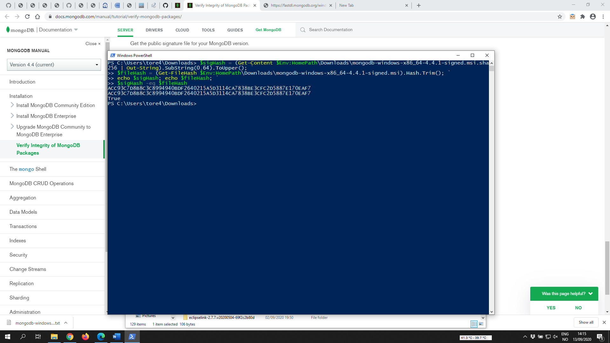
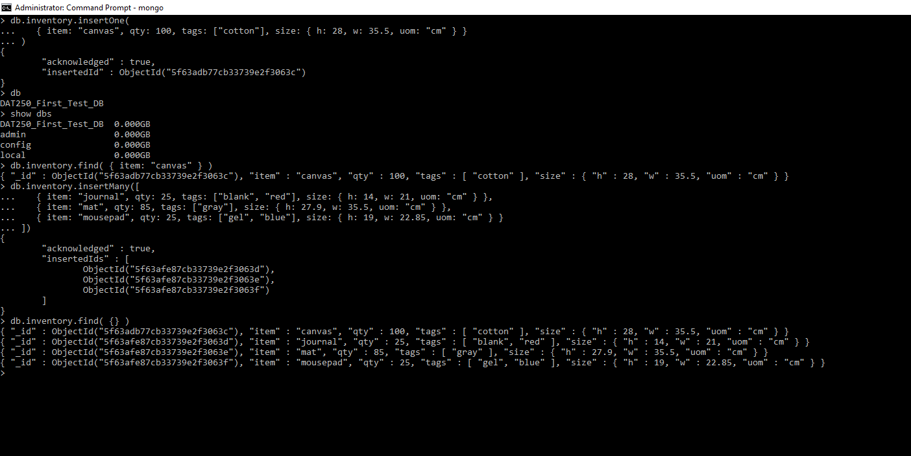
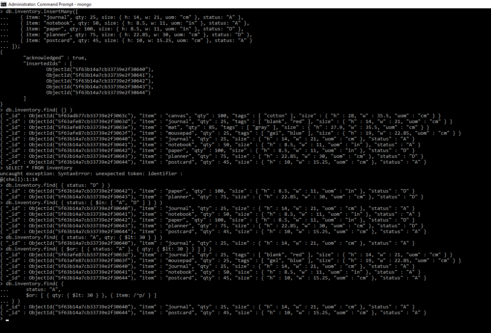
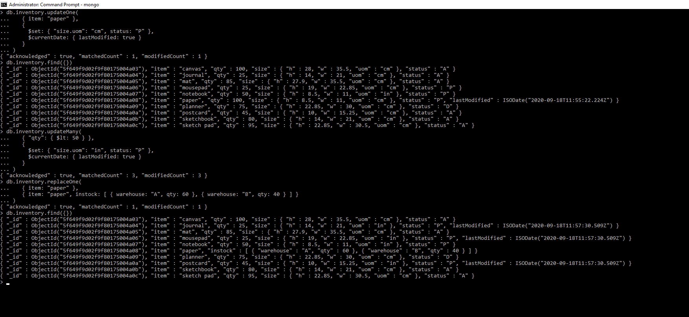
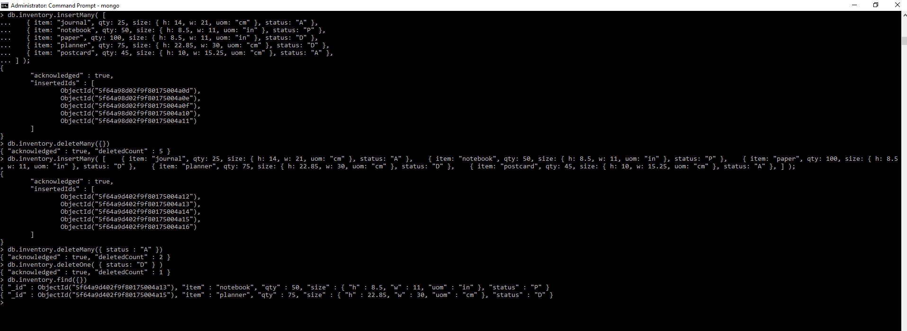
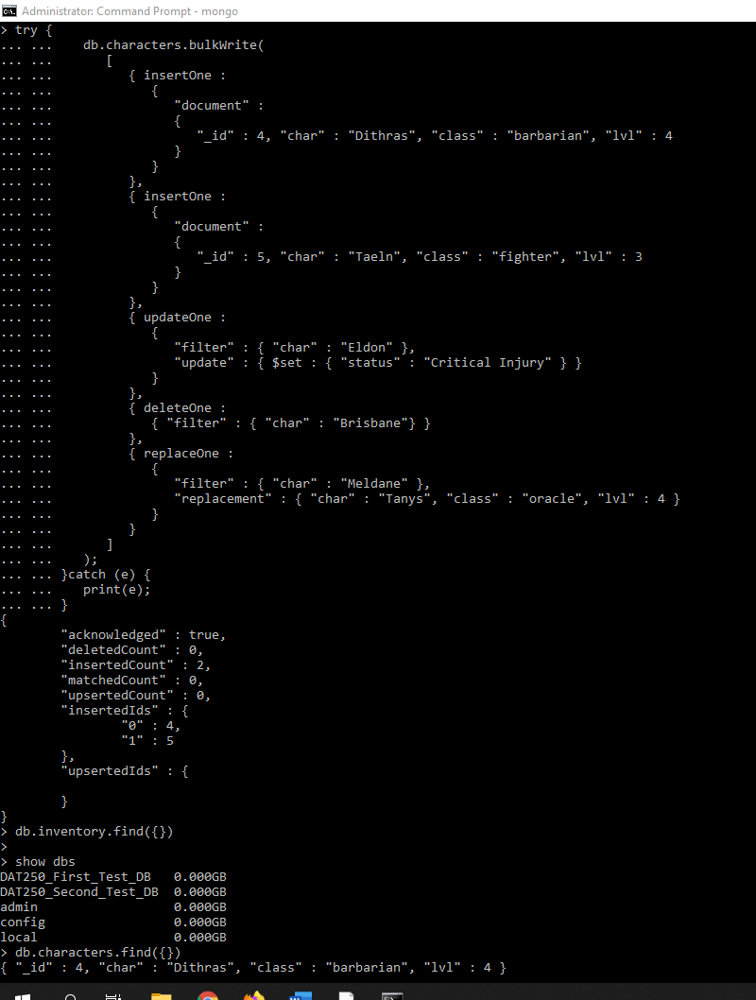
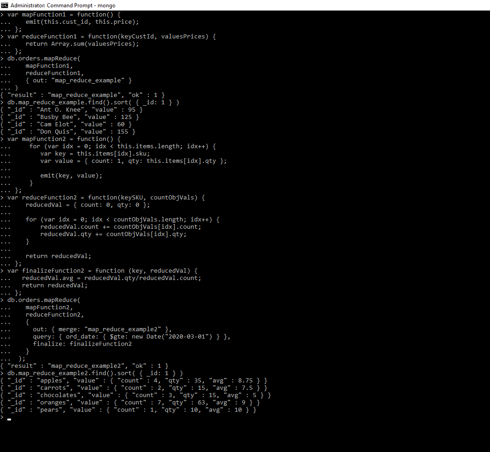
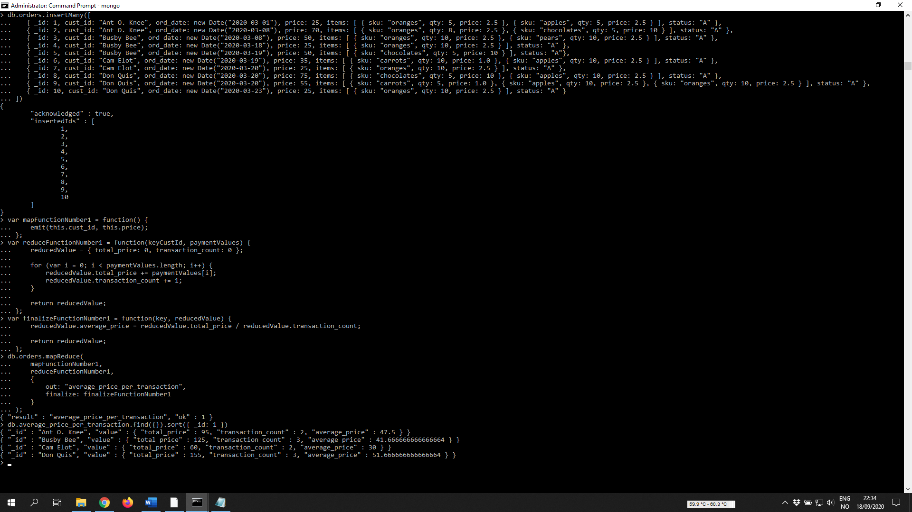

Technical problems
--------------------

None

Screenshots
------------

Validation of MongoDB installation package

CRUD operations
****************

Create: 

Read:

Update:

Delete:

Experiment 2

MapReduce operations

Self made MapReduce

MapReduce implementation
-------------------------

My Map-reduce operation can be used to find the average amount paid per transaction for each customer. 
This enables the user to quickly be able to determine how much each customer spends on average, 
and can be used to see if a transaction 

In addition, the resulting collection displays the total amount paid over all purchases 
and the number of transactions performed by each customer.
In other words, the document contains all the values necessary to manually perform the calculation 
and confirm the calcualted average price per transaction.

Pending issues
---------------

None

